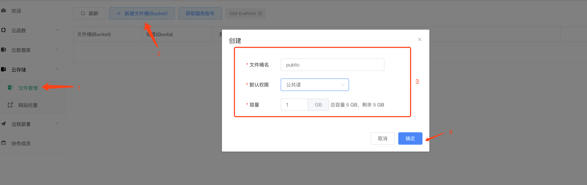
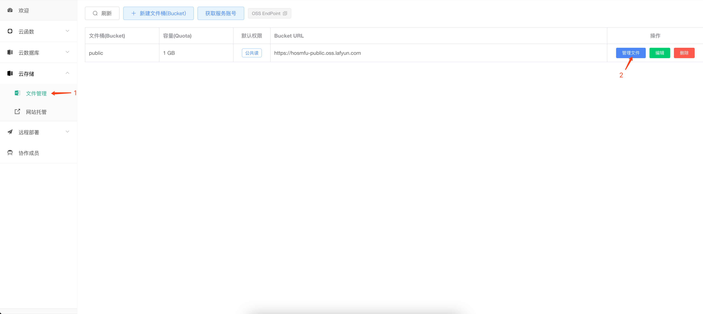
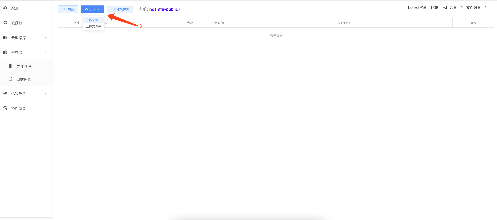
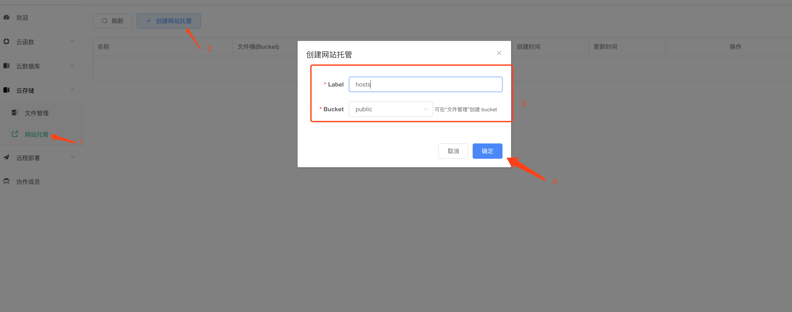
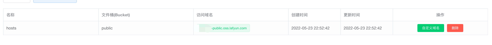

### 创建bucket

1. 左侧选择文件管理
2. 点击新建文件桶按钮
3. 填写所需信息，其中创建文件桶的权限必须为公共读
4. 点击确认

### 上传源码

1. 点击文件管理
2. 选择管理文件

3. 点击上传按钮，并选择需要上传的文件或者文件夹

### 创建网站托管

1. 左侧选择网站托管
2. 点击创建网站托管按钮
3. 填写所需信息
4. 点击确认

5. 列表显示默认访问域名，也可以点击自定义域名进行访问

### 注意事项
域名根路径对应bucket的根路径